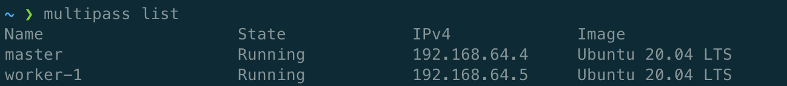

# Setup Servers

## How?

### The easiest way

Rent at least 2 VPS on [Digital Ocean](https://www.digitalocean.com/), [Vutr](https://www.vultr.com/), [Linode](https://www.linode.com/) or any cloud provider you want.

### Lab at home

First, you need to buy at least 2 Raspberry Pi 4 because you want to test a Kubernetes cluster.
Second, install which version of Ubuntu you prefer. Please choose the server versions because their size is more lightweight.
Finally, move to step two to learn how to setup your cluster.

### Virtual Machine

In this tutorial, I use [multipass](https://multipass.run) to run my virtual machines in both my macbook and PC. You are free to choose which software to create virtual machine (VirtualBox, VMWare) but you have to know how to connect them.

### Summary

After this step, you have to have at least 2 machine (VPS, Pi 4 or virtual machine) with 2 dedicated IP. In my case, they are

- Master: `192.168.64.4`
- Worker 1: `192.168.64.5`

The OS we are going to use is Ubuntu 20.04 LTS. Here is the results we have to achieve

Hardware requirements:

- Master:

  - RAM: 2GB Minimum
  - CPU: 1 Minimum

- Worker:

  - RAM: 1GB Minimum
  - CPU: 1 Minimum
