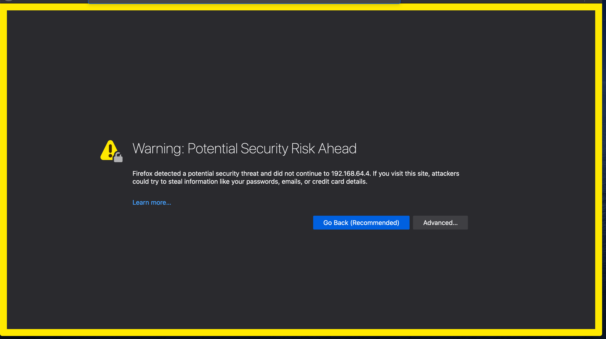
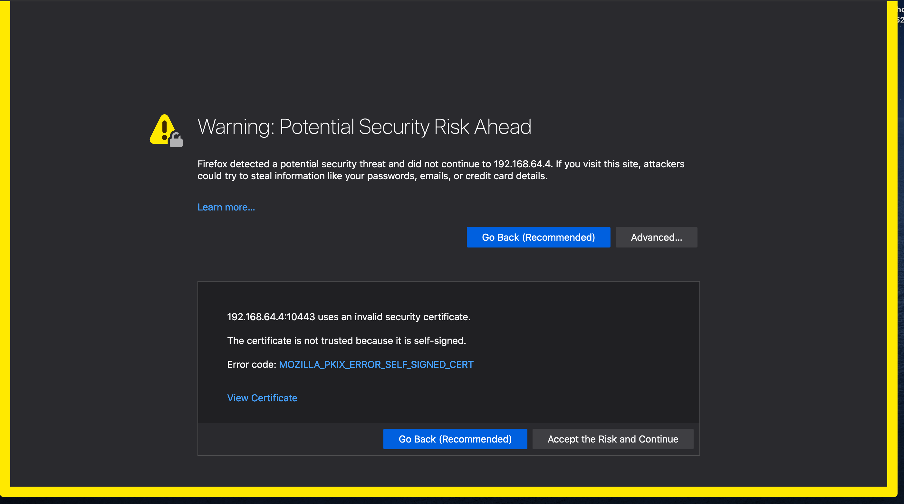
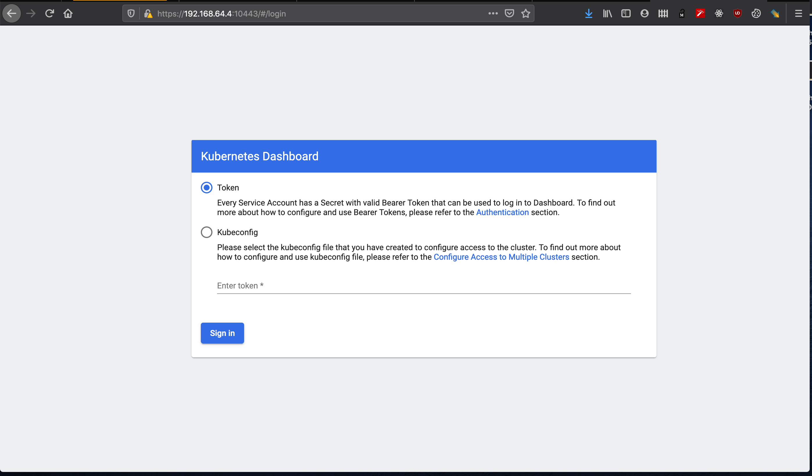

# Kubernetes Dashboard

## Overview

[The Web UI](https://kubernetes.io/docs/tasks/access-application-cluster/web-ui-dashboard/) is a great way to manage your Kubernetes Cluster. I had used it in almost Kubernetes clusters for 2 years. By the dashboard, you can monitor most resources in your cluster, know how many things are up, which are failed and why they are failed?


## Installation

You can install dashboard to your cluster by a simple command with hard-code version

```bash
export DASHBOARD_VERSION=v2.1.0
kubectl apply -f https://raw.githubusercontent.com/kubernetes/dashboard/${DASHBOARD_VERSION}/aio/deploy/recommended.yaml
```

Maybe, you want to use the latest version instead of choose a specific one. So, here is a script that helps you find the latest release in Github repository and use it.

```bash
export DASHBOARD_GITHUB_URL=https://github.com/kubernetes/dashboard/releases
export DASHBOARD_VERSION=$(curl -w '%{url_effective}' -I -L -s -S ${DASHBOARD_GITHUB_URL}/latest -o /dev/null | sed -e 's|.*/||')
kubectl apply -f https://raw.githubusercontent.com/kubernetes/dashboard/${DASHBOARD_VERSION}/aio/deploy/recommended.yaml
```

Then, you can verify you configurations by command

```bash
$ kubectl get pods -n kubernetes-dashboard
NAME                                         READY   STATUS    RESTARTS   AGE
dashboard-metrics-scraper-79c5968bdc-dvtld   1/1     Running   4          2d11h
kubernetes-dashboard-7448ffc97b-tkrxx        1/1     Running   4          2d11h
```

## Access Dashboard

### Create resources

By default, the installation above will create namespace (`kubernetes-dashboard`) with a default service account. But that process didn't grant any permissions to that account, so you can't access your dashboard with it.

Follow [an instruction of create demo user](https://github.com/kubernetes/dashboard/blob/master/docs/user/access-control/creating-sample-user.md), you can generate a full permission service account. Then, you can use it to access your dashboard with **security risk problem**

That why you have to create resources file (which is described bellow)

<details>
  <summary>dashboard-account.yaml</summary>
  
```YAML
apiVersion: v1
kind: ServiceAccount
metadata:
  name: dashboard-admin
  namespace: kubernetes-dashboard
---
apiVersion: rbac.authorization.k8s.io/v1
kind: ClusterRole
metadata:
  name: dashboard-admin
  namespace: kubernetes-dashboard
  annotations:
    rbac.authorization.kubernetes.io/autoupdate: "true"
rules:
  - apiGroups:
      - ""
    resources:
      - secrets
    verbs:
      - list
      - watch
  - apiGroups:
      - ""
    resources:
      - bindings
      - componentstatuses
      - configmaps
      - endpoints
      - events
      - limitranges
      - namespaces
      - nodes
      - persistentvolumeclaims
      - persistentvolumes
      - pods
      - pods/log
      - podtemplates
      - replicationcontrollers
      - resourcequotas
      - serviceaccounts
      - services
    verbs:
      - list
      - get
      - watch
  - apiGroups:
      - apps
      - extensions
      - storage.k8s.io
      - rbac.authorization.k8s.io
      - networking.k8s.io
      - batch
    resources: ["*"]
    verbs:
      - get
      - list
      - watch
---
apiVersion: rbac.authorization.k8s.io/v1
kind: ClusterRoleBinding
metadata:
  name: dashboard-admin
roleRef:
  apiGroup: rbac.authorization.k8s.io
  kind: ClusterRole
  name: dashboard-admin
subjects:
  - kind: ServiceAccount
    name: dashboard-admin
    namespace: kubernetes-dashboard
```
</details>

### What is the difference?

In the resource file above, I restricted access of the account `dashboard-admin` to be

- Only have `read` permissions (`get`, `list` and `watch`) to almost resources
- Except `secrets` (only allow `list` and `watch` permissions) . `secrets` is a place that store sensitive data and you want to keep it for yourself. In next chapter, I will guide you how to manage access to your cluster. So, you can create another resource file if you want.

### Get access

And deploy it to your cluster in namespace `kubernetes-dashboard`

```
kubectl apply -f dashboard-account.yaml -n kubernetes-dashboard
```

After that, you can use command bellow to get the access token

```bash
$ kubectl -n kubernetes-dashboard describe secret dashboard-admin | grep ^token
token:      eyJhbGciOiJSUzI1NiIsImtpZCI6ImRlSVVwS1ZxQ1RVU1huU0xCN0FaRzBVRktuYWdsLUlVUzNCNVQ1WmFjdDgifQ.eyJpc3MiOiJrdWJlcm5ldGVzL3NlcnZpY2VhY2NvdW50Iiwia3ViZXJuZXRlcy5pby9zZXJ2aWNlYWNjb3VudC9uYW1lc3BhY2UiOiJrdWJlcm5ldGVzLWRhc2hib2FyZCIsImt1YmVybmV0ZXMuaW8vc2VydmljZWFjY291bnQvc2VjcmV0Lm5hbWUiOiJkYXNoYm9hcmQtYWRtaW4tdG9rZW4tajUyZGIiLCJrdWJlcm5ldGVzLmlvL3NlcnZpY2VhY2NvdW50L3NlcnZpY2UtYWNjb3VudC5uYW1lIjoiZGFzaGJvYXJkLWFkbWluIiwia3ViZXJuZXRlcy5pby9zZXJ2aWNlYWNjb3VudC9zZXJ2aWNlLWFjY291bnQudWlkIjoiOTYxODAzMjctZmExYi00NWQzLWE1ZTItZTdlYmI4MjNjZTk5Iiwic3ViIjoic3lzdGVtOnNlcnZpY2VhY2NvdW50Omt1YmVybmV0ZXMtZGFzaGJvYXJkOmRhc2hib2FyZC1hZG1pbiJ9.PuZRFDwoXdh7lB6GIB54_zfSnpfsnyJpQvSsRnsZ7n1PEsb7dmsUlwFquk2kPWmOMk_JFQddChteX7EllsyfbZSlZ7s2reJanB8MAHwVyz1D1VhbDlz_HoEd-mehPsJHn0FYGz_AXd657l-5B5PM83dABcfL68f7IxBtM5R6dstxmG_NJ0Kr9xKFAUqlzgx4k2S3Jd8d-DcFTmnK0Dv7bTP7k2faj8rQZnlr-PA-5lBfFPAd-7JVflWQOlMnqZy9LjVd9xs8OuaHUAMA1_f4mMsPcVgml9VJGNu3jfFaqGc6YpExjhaUtigucLtEjBPTD_Vzwid-AuWD4gSZiAIkfQ
```

Finally, forward your deployment to outside cluster by command and open browser at [https://127.0.0.1:10443](https://127.0.0.1:10443/)

```
$ kubectl port-forward deployment/kubernetes-dashboard 10443:8443 --address 0.0.0.0 -n kubernetes-dashboard
Forwarding from 0.0.0.0:10443 -> 8443
```

Now, it's so sad because you got another problem :D



The problem is you are using self-certificate that is generate by Kubernetes Cluster. Absolutely, we know it's safe, but our browser don't. You have two choices: add the certificate to Truststore or just click to **Advanced** button (with Chrome or another browsers, you will see something difference) then click to **Accept the Risk**



Eureka! You find it! You can see the login screen now, please use the token above to login



## Remove

Because the dashboard is installed in a namespace `kubernetes-dashboard`, so you only need to delete that namespace to free up your cluster

```
kubectl delete ns kubernetes-dashboard
```

## Another way to manage your clusters

One day, I realized that I were too tired to manage multiple clusters by multiple dashboards. An idea was bumped in my head is let develop an application to help me optimize current workflow. But, be a developer, I'll research first to make sure some talent guys did it for me =))

Then, I found [k8slens](k8slens.dev/)


That is a great tool with amazing UI! Now you have a single place to manage your clusters.
