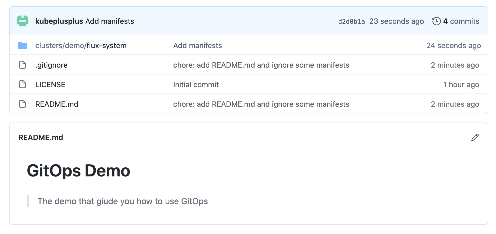

# Setup GitOps

## Requirements

- cURL
- K8S cluster
- GitHub Repository
- Flux CD

## Overview

There are a lot of articles that define what is GitOps, but I like an article from [Gitlab](https://about.gitlab.com/topics/gitops/) the most. So, following that article, we have three factors that operate your GitOps workflow

- The Git repository that is **single source of truth**. So, you only apply actions which is describe by your files in your repository. Because Git has their history, so you can revert your mistake easily, track who did the changes and the messages will tell you why they did that.
- Merge Requests. Any change should be the merge requests, but in my case, I usually use my commit directly. It is up to you and your team, choose the best way to do that.
- CI/CD. Absolutely you don't want to apply every single change by your hand =)). We are developers and we are lazy. Let's take a cup of coffee and the CI/CD will do the rest for you.

What are tools for demo?

- Git repository. I will use GitHub for our demo, but feel free to use your Git platform.
- CI tools. Because I used GitHub, so I will use GitHub Actions.
- CD tools. I have been used [Flux CD](https://fluxcd.io/) for one year and I totally happy with it.

## Prepare resources

### GitHub Repository

I created a repository to test at [GitOps Demo](https://github.com/kubeplusplus/gitops)

### GitHub Account

You have to register then generate the personal token (use [this tutorial](https://docs.github.com/en/github/authenticating-to-github/creating-a-personal-access-token)) to allow FluxCD apply any changes to your repository. After generate the token, you have to export your GitHub username and personal token to the environment because we will use it at [Installation Step](#Installation)

```bash
export GITHUB_TOKEN=<your-token>
export GITHUB_USER=<your-username>
```

## Installation

First, you have to set the environment variable `DEFAULT_BIN_DIR` to your 3rd libraries folder at `~/.kube/libs/bin`

```bash
export DEFAULT_BIN_DIR=~/.kube/libs/bin
```

Second, install Flux CD binary

```bash
$ curl -s https://toolkit.fluxcd.io/install.sh | sudo bash -s $DEFAULT_BIN_DIR
[INFO]  Downloading metadata https://api.github.com/repos/fluxcd/flux2/releases/latest
[INFO]  Using 0.6.3 as release
[INFO]  Downloading hash https://github.com/fluxcd/flux2/releases/download/v0.6.3/flux_0.6.3_checksums.txt
[INFO]  Downloading binary https://github.com/fluxcd/flux2/releases/download/v0.6.3/flux_0.6.3_linux_amd64.tar.gz
[INFO]  Verifying binary download
[INFO]  Installing flux to ~/.kube/libs/bin
```

Finally, verify your installation

```bash
$ flux -v
flux version 0.6.3
```

## Initialize workflow

You have to run a `bootstrap` command that points to your GitHub repository.

```bash
export GITHUB_REPO=gitops
export GITHUB_BRANCH=master
export CLUSTER_PATH=./clusters/demo

flux bootstrap github \
  --owner=$GITHUB_USER \
  --repository=$GITHUB_REPO \
  --branch=$GITHUB_BRANCH \
  --path=$CLUSTER_PATH \
  --personal
```

The command will use `GITHUB_TOKEN` and `GITHUB_USER` to authenticate your requests. Flux CD create repository if it isn't exist then commits Flux CD's manifests to `GITHUB_BRANCH` at folder `CLUSTER_PATH`.

> Note: Why do we have `CLUSTER_PATH` here? Because Flux CD allows you to configure multiple cluster in one repository, one thing you have to do here is select the path that saves Flux CD's manifests. I chose the name `demo` your demo purpose. You should choose some meaning name like `staging` and `production` for environment respectively.

<details>
  <summary>Example output</summary>

```LOG
► connecting to github.com
✔ repository cloned
✚ generating manifests
✔ components manifests pushed
► installing components in flux-system namespace
namespace/flux-system created
customresourcedefinition.apiextensions.k8s.io/alerts.notification.toolkit.fluxcd.io created
customresourcedefinition.apiextensions.k8s.io/buckets.source.toolkit.fluxcd.io created
customresourcedefinition.apiextensions.k8s.io/gitrepositories.source.toolkit.fluxcd.io created
customresourcedefinition.apiextensions.k8s.io/helmcharts.source.toolkit.fluxcd.io created
customresourcedefinition.apiextensions.k8s.io/helmreleases.helm.toolkit.fluxcd.io created
customresourcedefinition.apiextensions.k8s.io/helmrepositories.source.toolkit.fluxcd.io created
customresourcedefinition.apiextensions.k8s.io/kustomizations.kustomize.toolkit.fluxcd.io created
customresourcedefinition.apiextensions.k8s.io/providers.notification.toolkit.fluxcd.io created
customresourcedefinition.apiextensions.k8s.io/receivers.notification.toolkit.fluxcd.io created
role.rbac.authorization.k8s.io/crd-controller-flux-system created
rolebinding.rbac.authorization.k8s.io/crd-controller-flux-system created
clusterrolebinding.rbac.authorization.k8s.io/cluster-reconciler-flux-system created
service/notification-controller created
service/source-controller created
service/webhook-receiver created
deployment.apps/helm-controller created
deployment.apps/kustomize-controller created
deployment.apps/notification-controller created
deployment.apps/source-controller created
networkpolicy.networking.k8s.io/allow-scraping created
networkpolicy.networking.k8s.io/allow-webhooks created
networkpolicy.networking.k8s.io/deny-ingress created
Waiting for deployment "source-controller" rollout to finish: 0 of 1 updated replicas are available...
deployment "source-controller" successfully rolled out
deployment "kustomize-controller" successfully rolled out
deployment "helm-controller" successfully rolled out
deployment "notification-controller" successfully rolled out
✔ install completed
► configuring deploy key
✔ deploy key configured
► generating sync manifests
✔ sync manifests pushed
► applying sync manifests
◎ waiting for cluster sync
✔ bootstrap finished
```

</details>

Make sure resources (at `clusters/demo/flux-system`) is commited to your repository like image bellow



Verify Kubernetes resources

```bash
$ kubectl get namespaces
NAME              STATUS   AGE
default           Active   3d22h
kube-system       Active   3d22h
kube-public       Active   3d22h
kube-node-lease   Active   3d22h
ingress-nginx     Active   3d22h
flux-system       Active   6m11s # <-- new namespace is created
```

## Configuration

### Flow Overview

The first time I used Flux CD, it took me 30 minutes to understand the operation flow. So, let me summary what you should do to make it work smoothly

- First, define your chart source. Why do I call it is **chart source**? Because Flux CD is using Helm to manage your release, you can define your chart source by Helm Repository (Helm Stable, Bitnamy, Google and so forth), by Git repository (I usually define charts in my gitops repository too) and by Cloud Storage (I didn't use it yet).
- Second, define your Helm release that uses chart source at step one.
- Third (optional), define your webhooks or notifications.
- Finally, wait for you release is apply.

### Define Chart Sources

**IMPORTANT:** Because we will use our GitOps Repository to store our charts, so make sure you did update your local repository first. (Use `git pull`)

#### Git Repository

At your GitOps repository, create the `charts` folder that contains your custom charts then initialize a Nginx chart

```bash
$ mkdir charts && cd charts
$ helm create nginx
```

Then, create a `GitRepository` resource at path `clusters/demo/nginx-git/source.yaml`

```YAML
apiVersion: source.toolkit.fluxcd.io/v1beta1
kind: GitRepository
metadata:
  name: nginx-git
  namespace: flux-system
spec:
  interval: 1m
  url: https://github.com/kubeplusplus/gitops # make sure you change this url to your repository
  ref:
    branch: master
  ignore: |
    # exclude all
    /*
    # include charts directory
    !/charts/
```

#### Helm Repository

Create a `HelmRepository` resource at path `clusters/demo/nginx-helm/source.yaml`

```YAML
apiVersion: source.toolkit.fluxcd.io/v1beta1
kind: HelmRepository
metadata:
  name: nginx-helm
  namespace: flux-system
spec:
  interval: 1m
  url: https://charts.mirantis.com # make sure you change this url to your Helm repository
```

### Verify Chart Sources

Commit your files to GitHub, then monitor logs of FLux CD's Source Controller by commands

```bash
$ export SOURCE_CONTROLLER_POD_NAME=$(kubectl get pods -n flux-system -l app=source-controller -o jsonpath='{.items[0].metadata.name}')
$ kubectl logs -n flux-system -f $SOURCE_CONTROLLER_POD_NAME
...
{"level":"info","ts":"2021-01-24T12:20:11.031Z","logger":"controller.helmrepository","msg":"Starting Controller","reconciler group":"source.toolkit.fluxcd.io","reconciler kind":"HelmRepository"}
{"level":"info","ts":"2021-01-24T12:20:11.132Z","logger":"controller.gitrepository","msg":"Starting Controller","reconciler group":"source.toolkit.fluxcd.io","reconciler kind":"GitRepository"}
...
{"level":"info","ts":"2021-01-24T13:12:27.269Z","logger":"controller.helmrepository","msg":"Reconciliation finished in 1.589550966s, next run in 1m0s","reconciler group":"source.toolkit.fluxcd.io","reconciler kind":"HelmRepository","name":"nginx-helm","namespace":"flux-system"}
{"level":"info","ts":"2021-01-24T13:12:35.184Z","logger":"controller.gitrepository","msg":"Reconciliation finished in 2.248305686s, next run in 1m0s","reconciler group":"source.toolkit.fluxcd.io","reconciler kind":"GitRepository","name":"nginx-git-repo","namespace":"flux-system"}
```

Verify that all resources were pulled to your source controller pod

```bash
# Make sure parent folders were created
$ kubectl exec -n flux-system $SOURCE_CONTROLLER_POD_NAME -- ls /data
gitrepository
helmrepository

# Make sure Git Repository was fetched
$ kubectl exec -n flux-system $SOURCE_CONTROLLER_POD_NAME -- ls /data/gitrepository/flux-system
flux-system
nginx-git

# Make sure Helm Repository was fetched
$ kubectl exec -n flux-system $SOURCE_CONTROLLER_POD_NAME -- ls /data/helmrepository/flux-system
nginx-helm
```

### Define Releases

Now, your resources were on your cluster and readied to deploy, Let's create release manifest in your GitOps Repository

#### Git Repository

You have to create the YAML resource at `clusters/demo/nginx-git/release.yaml` with content

```YAML
apiVersion: helm.toolkit.fluxcd.io/v2beta1
kind: HelmRelease
metadata:
  name: nginx-git-release
  namespace: default
spec:
  interval: 5m
  chart:
    spec:
      chart: ./charts/nginx # The path to your chart at your repository
      version: '0.1.0' # Your chart version, NOT app version
      sourceRef:
        kind: GitRepository
        name: nginx-git
        namespace: flux-system
      interval: 1m
  values:
    ingress:
      hosts:
        host: nginx-git-release.local
        paths:
          - /
```

#### Helm Repository

You have to create the YAML resource at `clusters/demo/nginx-helm/release.yaml` with content

```YAML
apiVersion: helm.toolkit.fluxcd.io/v2beta1
kind: HelmRelease
metadata:
  name: nginx-helm-release
  namespace: default
spec:
  interval: 5m
  chart:
    spec:
      chart: nginx
      version: "0.1.0"
      sourceRef:
        kind: HelmRepository
        name: nginx-helm
        namespace: flux-system
      interval: 1m
  values:
    ingress:
      enabled: true
      hosts:
        - host: nnginx-helm-release.local
          paths:
            - /
```

### Verify Releases

Commit your manifests to your GitOps Repository, then monitor logs of your Helm Controller

```bash
$ export HELM_CONTROLLER_POD_NAME=$(kubectl get pods -n flux-system -l app=helm-controller -o jsonpath='{.items[0].metadata.name}')
$ kubectl logs -n flux-system -f $HELM_CONTROLLER_POD_NAME
...
{"level":"info","ts":"2021-01-24T13:30:53.498Z","logger":"controller.helmrelease","msg":"HelmChart 'flux-system/default-nginx-helm-release' is not ready","reconciler group":"helm.toolkit.fluxcd.io","reconciler kind":"HelmRelease","name":"nginx-helm-release","namespace":"default"}
{"level":"info","ts":"2021-01-24T13:30:53.698Z","logger":"controller.helmrelease","msg":"HelmChart 'flux-system/default-nginx-git-release' is not ready","reconciler group":"helm.toolkit.fluxcd.io","reconciler kind":"HelmRelease","name":"nginx-git-release","namespace":"default"}
...
```

Verify that all deployments are up by commands

```bash
$ kubectl get deployments
NAME                 READY   UP-TO-DATE   AVAILABLE   AGE
nginx-helm-release   1/1     1            1           4m5s
nginx-git-release    1/1     1            1           4m6s
```

> Optional: Test by cURL commands (use your public IP, mine is `192.168.64.4`)

<details>
  <summary>$ curl -H "Host: nginx-git-release.local" 192.168.64.4</summary>

```HTML
<!DOCTYPE html>
<html>
<head>
<title>Welcome to nginx!</title>
<style>
    body {
        width: 35em;
        margin: 0 auto;
        font-family: Tahoma, Verdana, Arial, sans-serif;
    }
</style>
</head>
<body>
<h1>Welcome to nginx!</h1>
<p>If you see this page, the nginx web server is successfully installed and
working. Further configuration is required.</p>

<p>For online documentation and support please refer to
<a href="http://nginx.org/">nginx.org</a>.<br/>
Commercial support is available at
<a href="http://nginx.com/">nginx.com</a>.</p>

<p><em>Thank you for using nginx.</em></p>
</body>
</html>
```

</details>

<details>
  <summary>$ curl -H "Host: nginx-helm-release.local" 192.168.64.4</summary>

```HTML
<!DOCTYPE html>
<html>
<head>
<title>Welcome to nginx!</title>
<style>
    body {
        width: 35em;
        margin: 0 auto;
        font-family: Tahoma, Verdana, Arial, sans-serif;
    }
</style>
</head>
<body>
<h1>Welcome to nginx!</h1>
<p>If you see this page, the nginx web server is successfully installed and
working. Further configuration is required.</p>

<p>For online documentation and support please refer to
<a href="http://nginx.org/">nginx.org</a>.<br/>
Commercial support is available at
<a href="http://nginx.com/">nginx.com</a>.</p>

<p><em>Thank you for using nginx.</em></p>
</body>
</html>
```

</details>

## Reference

You can check my public [GitOps Repository](https://github.com/kubeplusplus/gitops)

## What's next?

In this chapter, I only cover main parts that I have been applied for my team for one year. Maybe, it is not enough for you, so uou should check the [Official Document](https://toolkit.fluxcd.io/) for more details.

GitOps is the latest thing I introduce to you in this tutorial, but I have been working add more tips and tricks to `Appendix` articles. That maybe helps you avoid similar problems when you are working with GitOps.
